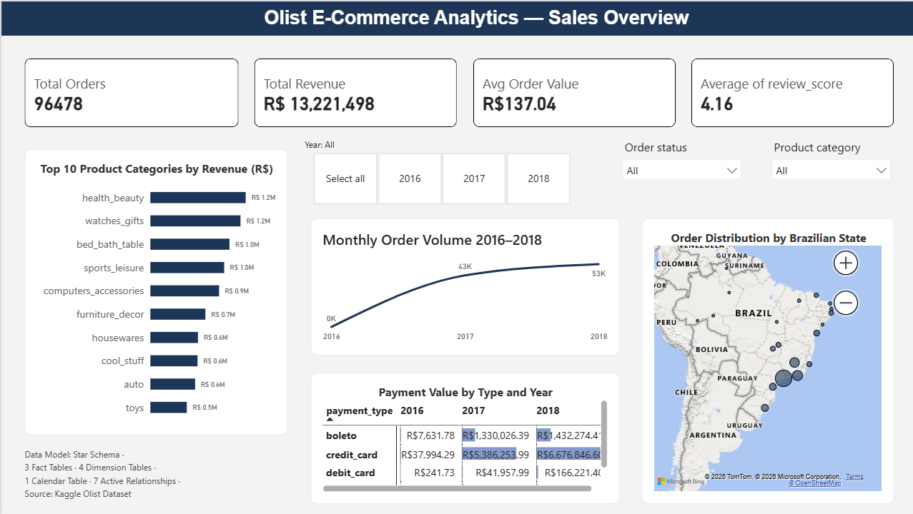
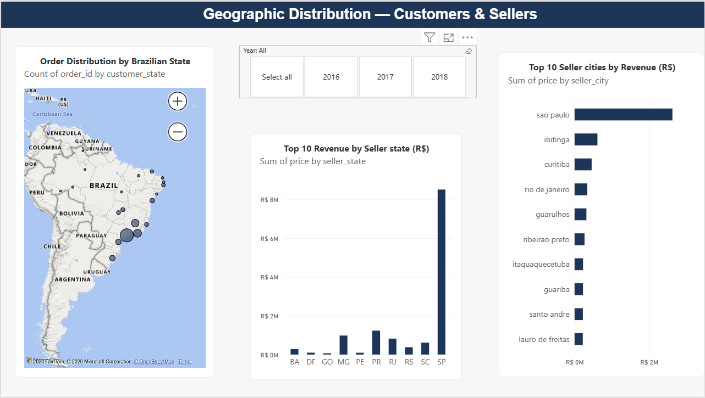
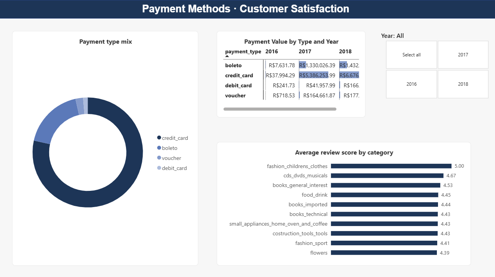
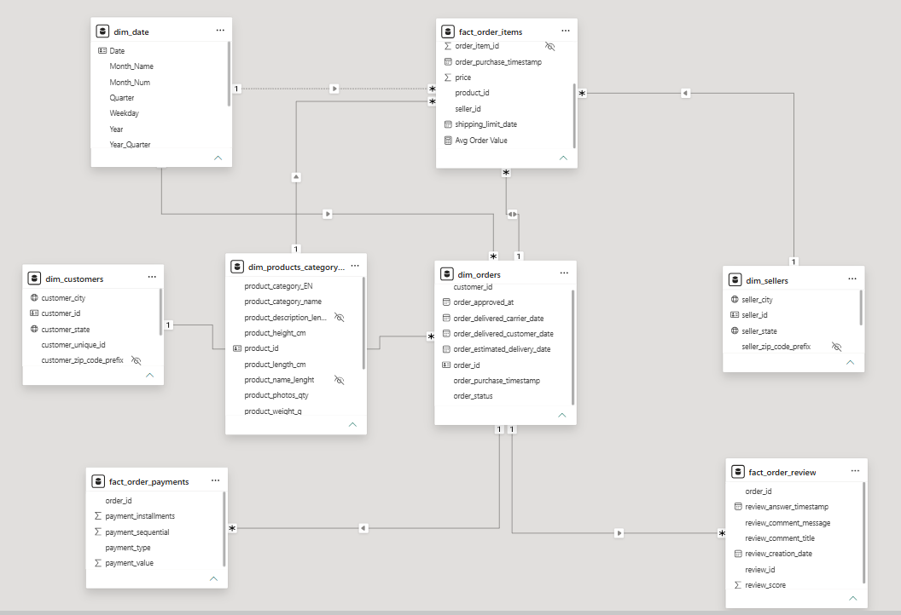
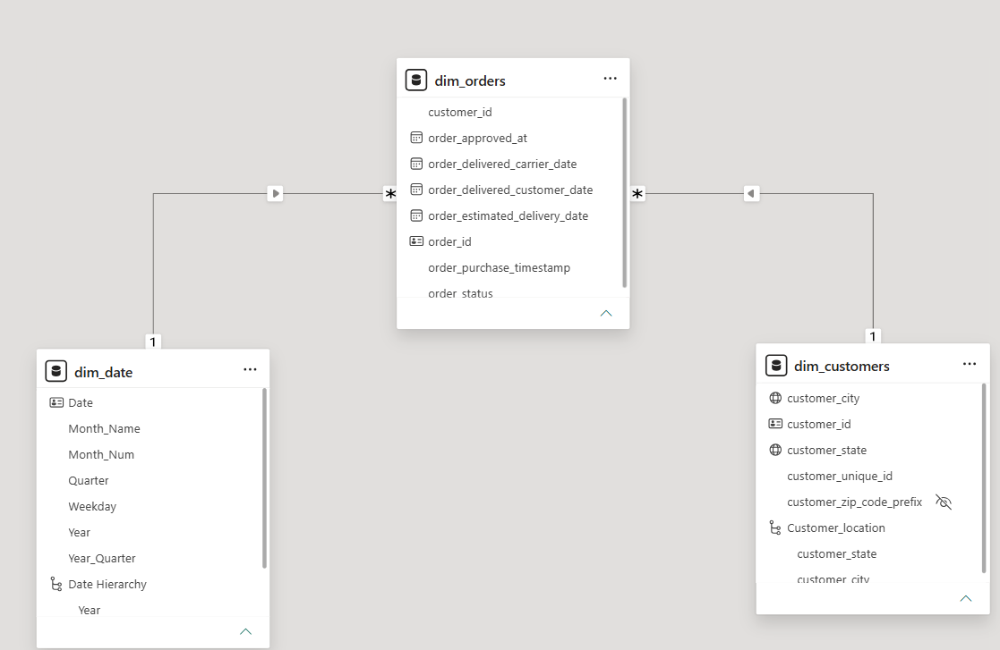
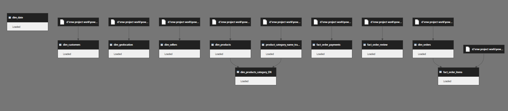

# 🛒 Olist Brazilian E-Commerce Analytics Dashboard

<div align="center">


**A 3-page Power BI analytics dashboard built on the Kaggle Olist Brazilian E-Commerce dataset — covering sales performance, geographic distribution of customers and sellers across Brazil, and payment method & customer satisfaction analysis. Powered by a production-grade Star Schema with 3 fact tables, 4 dimension tables, 1 calendar table, and 7 active relationships.**

</div>

---

## 📸 Dashboard Preview

### Page 1 — Sales Overview


> *KPI cards · Top 10 product categories by revenue · Monthly order volume 2016–2018 · Payment value by type and year · Order distribution map by Brazilian state.*

---

### Page 2 — Geographic Distribution · Customers & Sellers


> *Interactive Bing map of order distribution by customer state · Top 10 revenue by seller state · Top 10 seller cities by revenue.*

---

### Page 3 — Payment Methods · Customer Satisfaction


> *Payment type mix donut chart · Payment value by type and year matrix · Average review score by product category.*

---

## 📊 Key Metrics at a Glance

| Metric | Value |
|---|---|
| 🛒 **Total Orders** | 96,478 |
| 💰 **Total Revenue** | R$ 13,221,498 |
| 🧾 **Avg Order Value** | R$ 137.04 |
| ⭐ **Avg Review Score** | 4.16 / 5.00 |
| 📅 **Data Range** | 2016 – 2018 |
| 🗄️ **Source** | Kaggle Olist Dataset |

---

## 🗂️ Repository Structure

```
brazilian-ecommerce-dashboard/
│
├── 📄 README.md                          ← You are here
│
├── 📑 Brazilian_Ecommerce_Dashboard.pdf  ← Full static PDF export (3 pages)
│
└── 🖼️ Screenshots/
    ├── br_pg1.png                        ← Page 1: Sales Overview
    ├── br_pg2.png                        ← Page 2: Geographic Distribution
    ├── br_pg3.png                        ← Page 3: Payment Methods & Satisfaction
    ├── br_model_view.png                 ← Power BI Model View (Star Schema)
    ├── br_snowflake.png                  ← Snowflake schema close-up
    └── br_dependency_diagram.png         ← Power Query dependency diagram
```

---

## 🗄️ Data Model — Star Schema

This project implements a **Star Schema** with a central fact table surrounded by dimension tables — optimised for analytical querying in DAX and Power BI.

**Summary:** 3 Fact Tables · 4 Dimension Tables · 1 Calendar Table · 7 Active Relationships

### Model View


### Schema Close-up (dim_orders · dim_date · dim_customers)


---

### 📐 Tables & Relationships

#### Fact Tables

| Table | Key Columns | Description |
|---|---|---|
| `fact_order_items` | `order_item_id`, `order_purchase_timestamp`, `price`, `product_id`, `seller_id`, `shipping_limit_date`, `Avg Order Value` | Line-level order item data with pricing |
| `fact_order_payments` | `order_id`, `payment_installments`, `payment_sequential`, `payment_type`, `payment_value` | Payment transactions per order |
| `fact_order_review` | `order_id`, `review_answer_timestamp`, `review_comment_message`, `review_comment_title`, `review_creation_date`, `review_id`, `review_score` | Customer review records |

#### Dimension Tables

| Table | Key Columns | Description |
|---|---|---|
| `dim_orders` | `customer_id`, `order_approved_at`, `order_delivered_carrier_date`, `order_delivered_customer_date`, `order_estimated_delivery_date`, `order_id`, `order_purchase_timestamp`, `order_status` | Order lifecycle and status |
| `dim_customers` | `customer_city`, `customer_id`, `customer_state`, `customer_unique_id`, `customer_zip_code_prefix`, `Customer_location` | Customer demographic and location data |
| `dim_sellers` | `seller_city`, `seller_id`, `seller_state`, `seller_zip_code_prefix` | Seller location data |
| `dim_products_category_EN` | `product_category_EN`, `product_category_name`, `product_description_len`, `product_height_cm`, `product_id`, `product_length_cm`, `product_name_length`, `product_photos_qty`, `product_weight_g` | Product catalog with English-translated category names |

#### Calendar Table

| Table | Key Columns | Description |
|---|---|---|
| `dim_date` | `Date`, `Month_Name`, `Month_Num`, `Quarter`, `Weekday`, `Year`, `Year_Quarter`, `Date Hierarchy` | Time intelligence calendar for YoY, QoQ, and monthly analysis |

#### Relationship Map

| From | Cardinality | To |
|---|---|---|
| `dim_date[Date]` | 1 → * | `fact_order_items[order_purchase_timestamp]` |
| `dim_date[Date]` | 1 → * | `dim_orders[order_purchase_timestamp]` |
| `dim_orders[order_id]` | * ← 1 | `fact_order_items[order_id]` |
| `dim_orders[order_id]` | 1 → * | `fact_order_payments[order_id]` |
| `dim_orders[order_id]` | 1 → * | `fact_order_review[order_id]` |
| `dim_orders[customer_id]` | * → 1 | `dim_customers[customer_id]` |
| `dim_products_category_EN[product_id]` | 1 → * | `fact_order_items[product_id]` |
| `dim_sellers[seller_id]` | 1 → * | `fact_order_items[seller_id]` |

---

## ⚙️ Power Query — Dependency Diagram

All tables are loaded from local CSV files via Power Query with transformations applied before model load.



**Tables loaded via Power Query:**
`dim_date` · `dim_customers` · `dim_geolocation` · `dim_sellers` · `dim_products` · `product_category_name_translation` · `fact_order_payments` · `fact_order_review` · `dim_orders` → `fact_order_items` · `dim_products_category_EN` (derived via merge)

**Key transformations applied:**
- Portuguese → English category name translation via `product_category_name_translation` join
- `dim_products_category_EN` created by merging `dim_products` with the translation table
- `dim_date` generated as a calculated calendar table spanning the full order date range
- `Avg Order Value` measure computed at the `fact_order_items` level
- `Customer_location` geographic hierarchy built from `customer_state` + `customer_city` for Bing Maps

---

## 📈 Dashboard Pages — Detailed Breakdown

### 🔵 Page 1 — Sales Overview

**Filters:** Year (`2016` · `2017` · `2018`) · Order Status (dropdown) · Product Category (dropdown)

**KPI Cards**

| Metric | Value |
|---|---|
| Total Orders | 96,478 |
| Total Revenue | R$ 13,221,498 |
| Avg Order Value | R$ 137.04 |
| Avg Review Score | 4.16 |

**Top 10 Product Categories by Revenue (R$)**

| Rank | Category | Revenue |
|---|---|---|
| 1 | health_beauty | R$ 1.2M |
| 2 | watches_gifts | R$ 1.2M |
| 3 | bed_bath_table | R$ 1.0M |
| 4 | sports_leisure | R$ 1.0M |
| 5 | computers_accessories | R$ 0.9M |
| 6 | furniture_decor | R$ 0.7M |
| 7 | housewares | R$ 0.6M |
| 8 | cool_stuff | R$ 0.6M |
| 9 | auto | R$ 0.6M |
| 10 | toys | R$ 0.5M |

**Monthly Order Volume 2016–2018** *(Line chart)*
- Near-zero volume in 2016 (early platform data)
- Strong ramp through 2017 reaching ~43K orders/month
- Peak of ~53K orders/month in 2018

**Payment Value by Type and Year** *(Cross-tab matrix)*

| Payment Type | 2016 | 2017 | 2018 |
|---|---|---|---|
| boleto | R$ 7,631.78 | R$ 1,330,026.39 | R$ 1,432,274.41 |
| credit_card | R$ 37,994.29 | R$ 5,386,253.99 | R$ 6,676,846.60 |
| debit_card | R$ 241.73 | R$ 41,957.99 | R$ 166,221.40 |
| voucher | R$ 718.53 | R$ 164,661.87 | R$ 177,000+ |

**Order Distribution by Brazilian State** *(Bing Map — bubble size = order count)*
- São Paulo and southeast Brazil dominate bubble volume
- Sparse coverage in northern and central-western states

---

### 🟢 Page 2 — Geographic Distribution · Customers & Sellers

**Filter:** Year (`2016` · `2017` · `2018`)

**Order Distribution by Brazilian State** *(Bing bubble map)*
- Count of `order_id` by `customer_state`
- Southeast concentration with São Paulo as the dominant node

**Top 10 Revenue by Seller State (R$)** *(Vertical bar chart)*
- SP (São Paulo) overwhelmingly leads at ~R$ 8M+
- Remaining states (SC, RS, RJ, PR, PE, MG, GO, DF, BA) all under R$ 2M

**Top 10 Seller Cities by Revenue (R$)** *(Horizontal bar chart)*

| Rank | City |
|---|---|
| 1 | São Paulo |
| 2 | Ibitinga |
| 3 | Curitiba |
| 4 | Rio de Janeiro |
| 5 | Guarulhos |
| 6 | Ribeirão Preto |
| 7 | Itaquaquecetuba |
| 8 | Guariba |
| 9 | Santo André |
| 10 | Lauro de Freitas |

---

### 🔴 Page 3 — Payment Methods · Customer Satisfaction

**Filter:** Year (`2016` · `2017` · `2018`)

**Payment Type Mix** *(Donut chart)*
- `credit_card` — dominant share (~75%+ of volume)
- `boleto` — second largest
- `voucher` — small slice
- `debit_card` — minimal share

**Payment Value by Type and Year** *(Same matrix as Page 1, full 4-row view)*
- All four payment types tracked across all three years
- Credit card growth from R$ 38K (2016) → R$ 6.68M (2018) reflects platform maturation

**Average Review Score by Category** *(Horizontal bar chart — Top 10)*

| Rank | Category | Avg Score |
|---|---|---|
| 1 | fashion_childrens_clothes | 5.00 |
| 2 | cds_dvds_musicals | 4.67 |
| 3 | books_general_interest | 4.53 |
| 4 | food_drink | 4.45 |
| 5 | books_imported | 4.44 |
| 6 | books_technical | 4.43 |
| 7 | small_appliances_home_oven_and_coffee | 4.43 |
| 8 | construction_tools_tools | 4.43 |
| 9 | fashion_sport | 4.41 |
| 10 | flowers | 4.39 |

---

## 💡 Key Insights

- 📈 **Explosive growth trajectory** — monthly orders grew from near-zero in 2016 to ~53K/month by end of 2018, reflecting Olist's rapid marketplace expansion
- 💳 **Credit card dominates payments** — accounting for the vast majority of transaction value across all years; credit card revenue grew ~175× from 2016 to 2018
- 🗺️ **São Paulo is the undisputed commerce hub** — SP state alone accounts for ~R$ 8M+ in seller revenue, dwarfing all other states combined
- ⭐ **Overall satisfaction is high** — platform-wide avg review score of 4.16/5, with fashion_childrens_clothes achieving a perfect 5.00
- 🏆 **Health & beauty leads all categories** — at R$ 1.2M, tying with watches_gifts for top revenue position
- 🔗 **Robust star schema** — 7 active relationships across 8 tables enable cross-filtering between all 3 report pages without circular dependency
- 🗓️ **Boleto growth signals market trust** — boleto (bank slip) payments grew from R$ 7.6K in 2016 to R$ 1.43M in 2018, indicating growing confidence among non-card Brazilian consumers

---

## 🚀 Getting Started

### Prerequisites
- [Power BI Desktop](https://powerbi.microsoft.com/desktop/) (free download)
- [Kaggle Olist Dataset](https://www.kaggle.com/datasets/olistbr/brazilian-ecommerce) (9 CSV files)

### Setup Steps

```
1. Download the Kaggle Olist dataset CSVs

2. Open Power BI Desktop
   → Home → Get Data → Text/CSV
   → Load each CSV file:
      olist_orders_dataset.csv           → dim_orders
      olist_order_items_dataset.csv      → fact_order_items
      olist_order_payments_dataset.csv   → fact_order_payments
      olist_order_reviews_dataset.csv    → fact_order_review
      olist_customers_dataset.csv        → dim_customers
      olist_sellers_dataset.csv          → dim_sellers
      olist_products_dataset.csv         → dim_products
      product_category_name_translation.csv
      olist_geolocation_dataset.csv      → dim_geolocation

3. In Power Query Editor:
   → Merge dim_products with translation table on [product_category_name]
     to produce dim_products_category_EN
   → Apply data type corrections on all date columns
   → Build dim_date as a DAX calculated table or Power Query date table

4. In Model View:
   → Create 7 active relationships as documented in the Relationship Map above
   → Verify cardinality (1:* for all dim→fact connections)

5. Create DAX measures:
   → Total Revenue = SUM(fact_order_items[price])
   → Avg Order Value = AVERAGE(fact_order_items[price])
   → Total Orders = DISTINCTCOUNT(dim_orders[order_id])
   → Avg Review Score = AVERAGE(fact_order_review[review_score])

6. Build the 3 report pages using the screenshots as layout reference
```

---

## 🧰 Tech Stack

| Tool | Purpose |
|---|---|
| **Microsoft Power BI Desktop** | Dashboard development, model view, visuals |
| **Power Query (M language)** | ETL: CSV ingestion, joins, type casting, table merges |
| **DAX** | Calculated measures, KPIs, calendar table |
| **Bing Maps** | Geographic bubble maps for state-level distribution |
| **CSV (Kaggle Olist)** | Source data — 9 raw dataset files |
| **Star Schema** | Data model pattern: 3 fact + 4 dim + 1 calendar tables |

---

## 📬 Contributing

Contributions, issues, and feature requests are welcome. Feel free to open an issue or submit a pull request.

---

<div align="center">

Built with ❤️ from **CHIRAG MODI** using Power BI &nbsp;·&nbsp; Source: [Kaggle Olist Brazilian E-Commerce Dataset](https://www.kaggle.com/datasets/olistbr/brazilian-ecommerce) &nbsp;·&nbsp; 2016 – 2018

</div>
